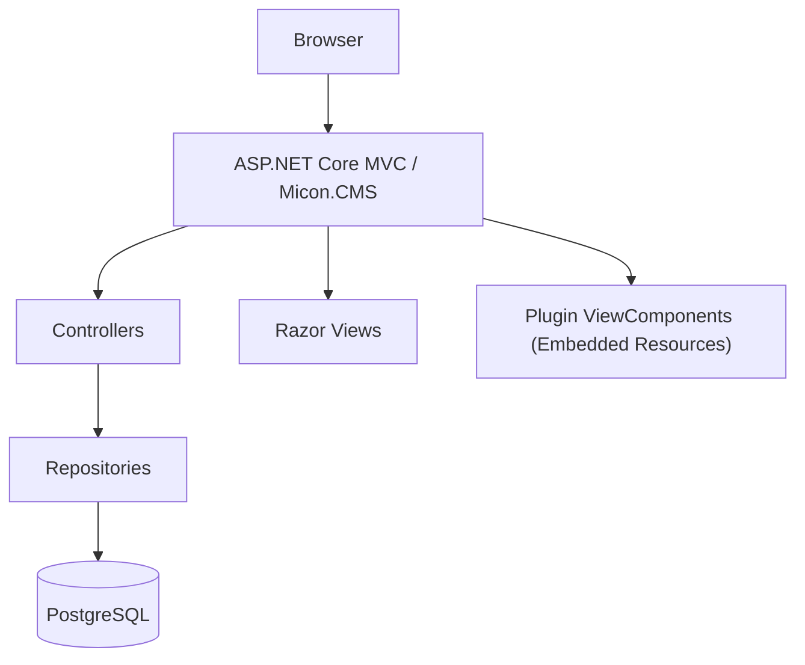
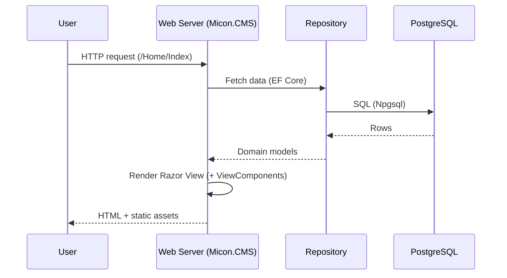
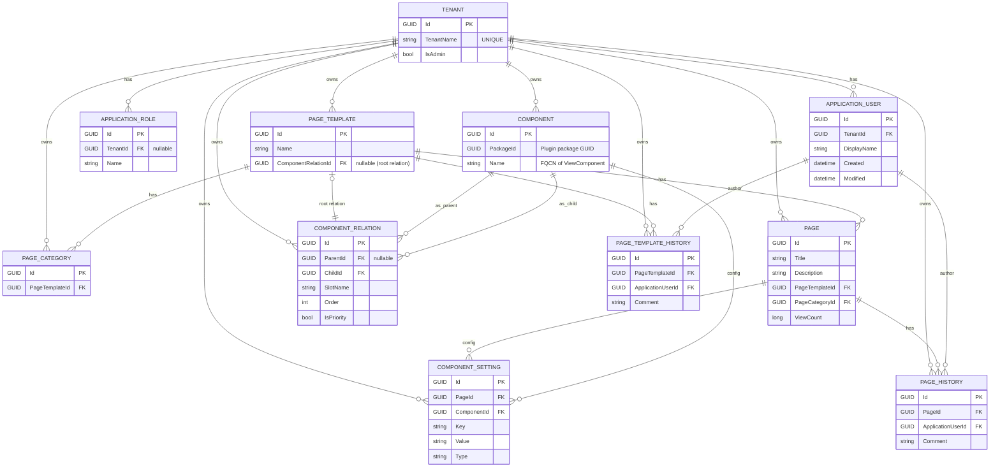

# Micon.CMS

モジュール拡張を前提に設計された、ASP.NET Core (.NET 9) ベースの軽量 CMS です。Razor のランタイム再コンパイル、プラグイン/テーマ機構、EF Core + PostgreSQL を活用して、拡張しやすく運用しやすい Web アプリケーションを目指します。


> 目標: シンプルなコアに、プラグイン/テーマで機能を追加して育てる「育てる CMS」。

## 目次
- プロジェクト概要
- 特徴
- アーキテクチャ
- クイックスタート（OS 別）
- 設定と環境変数
- プラグイン開発（拡張方法）
- データモデル（ER 図）
- 既知の注意点
- トラブルシュート
- テスト
- ライセンス / コントリビュート

## プロジェクト概要
- ソリューション: `Micon.CMS.sln`
- 主アプリ: `Micon.CMS`（ASP.NET Core, `net9.0`）
- ライブラリ: `Micon.CMS.Library`（共通モデル/拡張/サービス）
- サンプルプラグイン: `ClassLibrary1`（ViewComponent + 埋め込み Razor ビュー）
- テスト: `Micon.CMS.Tests`
- Aspire: `Micon.CMS.Aspire/Micon.CMS.Aspire.AppHost`, `Micon.CMS.Aspire/Micon.CMS.Aspire.ServiceDefaults`
- データベース: PostgreSQL（EF Core + Npgsql）
- 接続文字列キー: `micon-cms-db`（環境変数 `ConnectionStrings__micon-cms-db` で注入可能）

想定ユースケース
- プラグイン由来の ViewComponent を組み合わせてページを構成する CMS の基盤
- テーマ差し替えやプラグイン追加で段階的に機能拡張
- .NET エコシステムを活用した学習・実験・PoC

## 特徴
- プラグイン拡張（ViewComponent ベース）
  - アプリ起動時に `Micon.CMS/Plugins/**.dll` を自動検出・読み込み（`AddApplicationPart` 登録 + 埋め込みビュー解決）。
  - プラグインは `MiconCmsSettings.PackageId`（`static readonly Guid`）で一意識別。DB の `Components` と対応付けます。
 
- 認証/認可
  - ASP.NET Core Identity によるユーザー/ロール。
- データ永続化
  - EF Core + Npgsql（PostgreSQL）。起動時に `Database.Migrate()` を実行し自動でマイグレーションを適用。
  - マルチテナント前提のスキーマ。`CustomNpgsqlMigrationsSqlGenerator` が Row Level Security（RLS）ポリシーを自動付与。
- 開発体験
  - Razor ランタイム再コンパイル、`dotnet watch` によるホットリロード。
- サービスオーケストレーション
  - .NET Aspire の AppHost/ServiceDefaults を同梱（任意利用）。
- ルーティング（抜粋）
  - `/{tenant}/Setting/{controller=Home}/{action=Index}/{id?}`
  - `/{tenant}/{categoryId}/{pageId}`（公開ページ）
  - `/` → `/default` にリダイレクト（デフォルトテナント）

## アーキテクチャ


リクエストフロー（概略）


## クイックスタート（OS 別）
前提
- .NET SDK 9.0 以上（`dotnet --info` で確認）
- PostgreSQL 14+ 推奨

1) 依存関係復元 + ビルド
- Windows (PowerShell): `dotnet restore .; dotnet build Micon.CMS.sln`
- macOS/Linux (bash): `dotnet restore . && dotnet build Micon.CMS.sln`

2) 環境変数の設定（開発）
- Windows: `$env:ASPNETCORE_ENVIRONMENT = "Development"`
- macOS/Linux: `export ASPNETCORE_ENVIRONMENT=Development`

3) 接続文字列の設定（例: ローカル PostgreSQL）
- Windows: `$env:ConnectionStrings__micon-cms-db = "Host=localhost;Port=5432;Database=micon_cms;Username=postgres;Password=postgres;"`
- macOS/Linux: `export ConnectionStrings__micon-cms-db='Host=localhost;Port=5432;Database=micon_cms;Username=postgres;Password=postgres;'`

4) DB マイグレーションの適用（初回）
- 共通: `dotnet ef database update --project Micon.CMS`
  - `dotnet-ef` が無い場合は `dotnet tool install --global dotnet-ef`

5) 実行（Debug 推奨）
- 共通: `dotnet run --project Micon.CMS`
  - 初回起動時も `Database.Migrate()` が実行されます。

ホットリロード
- 共通: `dotnet watch --project Micon.CMS run`

Aspire AppHost（任意）
- Windows: `dotnet run --project "Micon.CMS.Aspire/Micon.CMS.Aspire.AppHost"`
- macOS/Linux: `dotnet run --project Micon.CMS.Aspire/Micon.CMS.Aspire.AppHost`

## 設定と環境変数
- `ASPNETCORE_ENVIRONMENT`: `Development` / `Production`
- 接続文字列キー: `micon-cms-db`
  - 環境変数 `ConnectionStrings__micon-cms-db` で注入可能
- `appsettings.json` / `appsettings.Development.json`: ロギング等の設定

## プラグイン開発（拡張方法）
- 配置と自動認識
  - ビルド済みプラグイン DLL を `Micon.CMS/Plugins/` 配下へ配置するだけで自動認識（再帰検索）。
  - 起動時に MVC の `ApplicationPart` として登録し、埋め込み Razor ビューは `EmbeddedFileProvider` で解決します。
- コンポーネントの識別
  - 各プラグインは `MiconCmsSettings.PackageId`（`static readonly Guid`）で識別し、DB の `Components.PackageId` と対応します。
- ViewComponent をライブラリから提供
```csharp
// プラグイン側（例）
using Microsoft.AspNetCore.Mvc;
namespace ClassLibrary1.Components.Test;
public class TestViewComponent : ViewComponent
{
    public IViewComponentResult Invoke(string message) => View("Default", message);
}
```
```cshtml
@* Micon.CMS の Razor から *@
@await Component.InvokeAsync("Test", new { message = "Hello from plugin" })
```
- 親ビューからスロット描画
```cshtml
@* 親コンポーネントのビュー例 *@
@model Micon.CMS.Library.Models.Form.PageComponentViewModel
<div class="content">
  @await Html.LoadChildComponentAsync(Component, "Main")
  @await Html.LoadChildComponentAsync(Component, "Sidebar")
  @await Html.LoadChildComponentAsync(Component, "Footer")
</div>
```

### 最小構成のプラグイン例
1) クラスライブラリ（`net9.0`）を作成し、Razor ビューを埋め込みリソースに含めます。
```xml
<Project Sdk="Microsoft.NET.Sdk">
  <PropertyGroup>
    <TargetFramework>net9.0</TargetFramework>
    <ImplicitUsings>enable</ImplicitUsings>
    <Nullable>enable</Nullable>
  </PropertyGroup>
  <ItemGroup>
    <!-- ViewComponent の Razor ビューを埋め込みリソースに含める -->
    <EmbeddedResource Include="Views\Shared\Components\Hello\Default.cshtml" />
    <!-- 必要に応じて _ViewImports を同梱（TagHelper 等を有効化） -->
    <Content Include="Views\_ViewImports.cshtml">
      <CopyToPublishDirectory>PreserveNewest</CopyToPublishDirectory>
    </Content>
  </ItemGroup>
  <!-- Razor SDK を使わない EmbeddedResource 方式のため、追加の設定は不要 -->
  <!-- （Razor Class Library を使う場合は RCL テンプレートでも可） -->
  <!-- 例: dotnet new razorclasslib -n MyPluginRcl -->
</Project>
```

2) プラグイン識別子を用意し、ViewComponent を実装します。
```csharp
// MiconCmsSettings.cs（プラグイン識別子）
public class MiconCmsSettings
{
    public static readonly Guid PackageId = new("aaaaaaaa-bbbb-cccc-dddd-eeeeeeeeeeee");
}

// Components/HelloViewComponent.cs
using Microsoft.AspNetCore.Mvc;
namespace MyPlugin.Components.Hello;
public class HelloViewComponent : ViewComponent
{
    public IViewComponentResult Invoke(string name = "world") => View("Default", name);
}
```

3) DLL を配置
- `MyPlugin.dll`（および必要な依存 DLL）を `Micon.CMS/Plugins/` 配下に配置します。

4) DB にコンポーネントを登録（最低限）
- `Components` に以下を登録します。
  - `PackageId` = プラグイン側 `MiconCmsSettings.PackageId`
  - `Name` = `MyPlugin.Components.HelloViewComponent`（ViewComponent の完全修飾名）
- ルートとなる `ComponentRelations` を作成し、`PageTemplates.ComponentRelationId` に割り当てます。
- 必要に応じて同一スロットに複数の子を `Order` で並び替え可能です。

5) ページを作成
- `PageCategories` と `Pages` を作成し、ページ単位の設定は `ComponentSettings`（Key/Value）に保存します。

補足
- 本リポには動作サンプルとして `Plugins/ClassLibrary1.dll`（PackageId: `fd90ba15-f824-456a-b451-7b0bd102c273`）が含まれます。型名例: `ClassLibrary1.Components.C1ViewComponent` / `ClassLibrary1.Components.C2ViewComponent`。
- 詳細な手順は `docs/plugins.md` も参照してください。

### ランタイムの解決フロー（要点）
- 起動時に `Plugins/**.dll` を再帰的に読み込み、MVC に `ApplicationPart` として登録。埋め込みビューは `EmbeddedFileProvider` で解決。
- `AssemblyService` が `MiconCmsSettings.PackageId` を持つアセンブリを辞書化し、`PackageId`→`Assembly` を引き当てます。
- `PageTemplateRepository.GetComponentHierarchy(...)` が `ComponentRelations` を再帰展開し、`ExternalController` が `PageComponentViewModel` を構築。
- 描画時に `AssemblyService.GetType(PackageId, ComponentName)` で型を特定し ViewComponent を呼び出します。

## プラグイン詳細（アーキテクチャと実装ガイド）

概要
- 検出: 起動時に `Micon.CMS/Plugins/**.dll` を走査して読み込み（例外はコンソールに記録）。
- 登録: 読み込んだアセンブリを MVC の `ApplicationPart` に追加し、プラグイン内のコントローラ/VC を公開。
- ビュー: `.cshtml` はプラグイン側 `.csproj` で `EmbeddedResource` として埋め込み、`EmbeddedFileProvider` で解決。
- 解決: `MiconCmsSettings.PackageId` → `AssemblyService` がアセンブリ辞書化 → `GetType(packageId, fqcn)` で VC 型を取得して実行。

推奨プロジェクト構成（プラグイン側）
```
MyPlugin/
├─ Components/
│  └─ Hello/HelloViewComponent.cs
├─ Views/
│  └─ Shared/Components/Hello/Default.cshtml
├─ Views/_ViewImports.cshtml    # 必要に応じて（TagHelper 有効化など）
└─ MiconCmsSettings.cs         # PackageId を定義
```

.csproj（埋め込みビュー方式）
```xml
<Project Sdk="Microsoft.NET.Sdk">
  <PropertyGroup>
    <TargetFramework>net9.0</TargetFramework>
    <ImplicitUsings>enable</ImplicitUsings>
    <Nullable>enable</Nullable>
  </PropertyGroup>
  <ItemGroup>
    <!-- ViewComponent の Razor ビューを埋め込みリソースに含める -->
    <EmbeddedResource Include="Views\Shared\Components\Hello\Default.cshtml" />
    <!-- 必要に応じて _ViewImports を同梱（TagHelper 等を有効化） -->
    <Content Include="Views\_ViewImports.cshtml">
      <CopyToPublishDirectory>PreserveNewest</CopyToPublishDirectory>
    </Content>
  </ItemGroup>
  <!-- RCL（Razor Class Library）でも可。EmbeddedResource 方式とどちらかに統一してください。 -->
</Project>
```

プラグイン識別子と VC 実装
```csharp
// MiconCmsSettings.cs（必須）
public class MiconCmsSettings
{
    public static readonly Guid PackageId = new("aaaaaaaa-bbbb-cccc-dddd-eeeeeeeeeeee");
}

// Components/Hello/HelloViewComponent.cs
using Microsoft.AspNetCore.Mvc;
using Micon.CMS.Library.Models.Form; // Model を使う場合
namespace MyPlugin.Components.Hello;
public class HelloViewComponent : ViewComponent
{
    public IViewComponentResult Invoke(string name = "world")
        => View("Default", name); // あるいは View(PageComponentViewModel)
}
```

ビュー配置と子スロット描画
```cshtml
@* Views/Shared/Components/Hello/Default.cshtml *@
@model Micon.CMS.Library.Models.Form.PageComponentViewModel
<section class="hello">
  <h1>Hello</h1>
  @* 子コンポーネントの描画（スロット名で解決） *@
  @await Html.LoadChildComponentAsync(Component, "Main")
</section>
```

モデル（PageComponentViewModel）
- `ComponentId`（GUID）: DB 上の `Components.Id`
- `ComponentName`（string）: ViewComponent の完全修飾名（FQCN）
- `SlotName`（string）: 親から見た配置スロット名
- `PackageId`（GUID?）: `MiconCmsSettings.PackageId`
- `Settings`（Dictionary<string,string>）: ページ単位のキー/値設定
- `Children`（List<PageComponentViewModel>）: 子コンポーネント群

DB 登録（GUI 予定）
- 今後 GUI（管理画面）から以下を登録・紐付けできるようにします。
  - `Components`: `PackageId` と `Name`（VC の FQCN）
  - `ComponentRelations`: 親子・`SlotName`・`Order`
  - `PageTemplates`: ルートの `ComponentRelationId`
  - `Pages`/`PageCategories` と `ComponentSettings`（ページ単位のキー/値）
  
現時点の運用方針
- GUI 完成までは、開発環境での初期データ投入（Seed）やテスト用コード/スクリプトで代替してください（本 README では SQL 手順は記載しません）。

依存関係と DI
- プラグインの VC でもコンストラクタ DI が利用可能（例: `ITestService` の注入）。
- 共有モデル/拡張を使う場合は `Micon.CMS.Library` を参照してください。

互換性と制約
- 対応 TFMs: `net9.0` を推奨（ホストと一致させる）。
- VC の型名は DB `Components.Name` と FQCN で一致させる必要があります。
- `.cshtml` を埋め込み忘れた場合、ビューが見つからず 404/エラーになります。

よくあるハマりどころ
- 型が見つからない: `Components.Name` が FQCN でない／`PackageId` が不一致。
- ビューが読み込めない: `.csproj` の `EmbeddedResource` 設定漏れ／`_ViewImports` 未同梱。
- 実行時例外: 依存 DLL の未配置（`Plugins/` に依存 DLL も同梱）。

同梱サンプル
- `Plugins/ClassLibrary1.dll`（PackageId: `fd90ba15-f824-456a-b451-7b0bd102c273`）。
  - `ClassLibrary1.Components.C1ViewComponent` は `PageComponentViewModel` を受け取り、子スロット `ChildSlot` を描画します。
  - `ClassLibrary1.Components.C2ViewComponent` は子として描画される簡易 VC です。

## データモデル（ER 図）


要点
- `Component` はプラグイン ViewComponent の「完全修飾型名（`Name`）」と「プラグイン識別子（`PackageId`）」を保持します。
- `ComponentRelation` は親子関係を表し、子がどの `SlotName` に描画されるかと `Order`（並び順）を管理します。
- `PageTemplate` は 1 件の `ComponentRelation` をルートとして採用し、ページ描画のコンポーネントツリーを決定します。
- `ComponentSetting` はページ単位のキー/値設定を保持し、コンポーネント側の挙動を調整します。

## 既知の注意点
- マルチテナント/RLS
  - マイグレーション時に RLS を自動付与します（`current_setting('app.current_tenant')` を利用）。アプリ側で GUC をセットする仕組みは今後拡張予定です（現状は `ApplicationDbContext` が固定の `TenantId` を採用）。
- プラグインの埋め込みビュー
  - 埋め込みに失敗するとビューが見つからないことがあります。`.csproj` の `EmbeddedResource` 設定と `Views/_ViewImports.cshtml` の同梱に注意してください。

## トラブルシュート
- 接続文字列が解決されない
  - 環境変数 `ConnectionStrings__micon-cms-db` の設定を確認。
- マイグレーション/EF コマンドが失敗する
  - `dotnet tool install --global dotnet-ef` を実行し、コマンドに `--project Micon.CMS` を付与。
- プラグインが認識されない/実行時エラー
  - 依存 DLL の配置漏れ、`PackageId` の不一致、`Components.Name` が FQCN になっていない等を確認。

## テスト
- すべてのテストを実行: `dotnet test Micon.CMS.sln`

## ライセンス / コントリビュート
- ライセンス: `LICENSE.txt` を参照。
- Issue/PR 歓迎。OS 別コマンドや細則は `AGENTS.md` にもまとめています。

## 付録: リポジトリ構成（抜粋）
```
Micon.CMS.sln
├─ Micon.CMS                   # ASP.NET Core MVC アプリ
├─ Micon.CMS.Library           # 共有モデル/サービス/拡張
├─ ClassLibrary1               # サンプルプラグイン（埋め込みビュー）
├─ Micon.CMS.Tests             # xUnit テスト
└─ Micon.CMS.Aspire            # Aspire AppHost / ServiceDefaults
```

## 更新メモ（2025-09-07 現在）
- プラグイン読み込みは `Plugins/**.dll` の自動検出に統一しました。従来の「`bin/Debug/net9.0` からの直接ロード」に依存しません。
