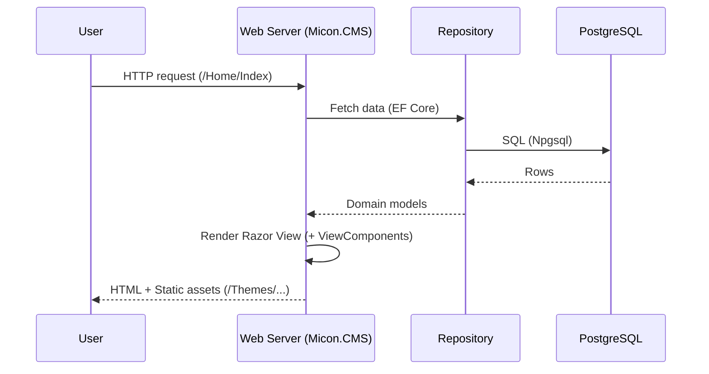

# Micon.CMS

モジュール拡張を前提に設計された、ASP.NET Core（.NET 9）ベースの軽量CMSです。Razorのランタイム再コンパイルやプラグイン/テーマ機構、EF Core（PostgreSQL）を活用して、拡張しやすく運用しやすいWebアプリケーションを目指しています。


> 目的: シンプルなコアに、プラグイン/テーマで機能を追加していける「育てるCMS」。

## 目次
- 概要
- 特徴（What it can do）
- コンポーネント図 / アーキテクチャ
- クイックスタート（OS別）
- 設定と環境変数
- 開発のヒント（拡張方法）
- 既知の注意点
- トラブルシュート
- ライセンス / コントリビュート

## 概要
Micon.CMS は、以下の設計方針で構築されています。
- 拡張容易性: プラグインやテーマで安全に拡張。
- 運用容易性: DBマイグレーション自動適用、Razorランタイム再コンパイル。
- .NET ネイティブ: EF Core、Identity、Razor、Aspire などの標準技術を活用。

想定ユースケース
- プラグイン由来のビュー/コンポーネントでWebページを構成するCMSの基盤。
- テーマ切替や拡張コンポーネントの追加を通じてサイトを段階的に拡張。
- .NET エコシステムを用いた学習/実験・PoC。

## 特徴（What it can do）
- モジュール/プラグイン拡張
  - `Plugins/Pages` 配下のページ/テーマ資産を参照可能。
  - `ClassLibrary1` などのライブラリから、埋め込みリソースとして ViewComponent 等を提供可能。
- テーマ/静的ファイル
  - `Plugins/Pages/Themes` を `/Themes` パスにマウントして配信。
- 認証/認可
  - ASP.NET Core Identity（ユーザー/ロール/トークン）。
- データ永続化
  - EF Core + Npgsql（PostgreSQL）。起動時に `Database.Migrate()` を実行。
- 開発者体験
  - Razor ランタイム再コンパイル、`dotnet watch run` によるホットリロード。
- サービスオーケストレーション
  - .NET Aspire の AppHost/ServiceDefaults を同梱（任意利用）。

## コンポーネント図 / アーキテクチャ
```mermaid
graph TD
  Browser[Browser] --> App[ASP.NET Core MVC<br/>Micon.CMS]
  App --> Ctrls[Controllers]
  Ctrls --> Repos[Repositories]
  Repos --> DB[(PostgreSQL)]
  App --> Views[Razor Views]
  App --> Themes[/Plugins/Pages/Themes -> /Themes/]
  App --> VC[ClassLibrary1 ViewComponents<br/>(Embedded Resources)]
```

リクエストフロー（概略）


## クイックスタート（OS別）
前提
- .NET SDK 9.0 以上（`dotnet --info`）
- PostgreSQL 14+ 推奨

1) 依存関係の復元とビルド
- Windows (PowerShell): `dotnet restore .; dotnet build Micon.CMS.sln`
- macOS/Linux (bash): `dotnet restore . && dotnet build Micon.CMS.sln`

2) 環境変数の設定（開発）
- Windows: `$env:ASPNETCORE_ENVIRONMENT = "Development"`
- macOS/Linux: `export ASPNETCORE_ENVIRONMENT=Development`

3) 接続文字列の設定（例: ローカルPostgreSQL）
- Windows: `$env:ConnectionStrings__micon-cms-db = "Host=localhost;Port=5432;Database=micon_cms;Username=postgres;Password=postgres;"`
- macOS/Linux: `export ConnectionStrings__micon-cms-db='Host=localhost;Port=5432;Database=micon_cms;Username=postgres;Password=postgres;'`

4) 実行（Debug推奨）
- 共通: `dotnet run --project Micon.CMS`
  - 初回起動時に自動でDBマイグレーションを適用します。

ホットリロード
- 共通: `dotnet watch --project Micon.CMS run`

Aspire AppHost（任意）
- Windows: `dotnet run --project "Micon.CMS.Aspire/Micon.CMS.Aspire.AppHost"`
- macOS/Linux: `dotnet run --project Micon.CMS.Aspire/Micon.CMS.Aspire.AppHost`

## 設定と環境変数
- 環境: `ASPNETCORE_ENVIRONMENT`（Development/Production）
- 接続文字列キー: `micon-cms-db`
  - 環境変数で `ConnectionStrings__micon-cms-db` を設定可能
- `appsettings.json` / `appsettings.Development.json` によるロギング等

## 開発のヒント（拡張方法）
- プラグイン/テーマの追加
  - `Plugins/Pages` 配下に静的資産やRazorページを配置。
  - テーマ資産は `/Themes` として配信されるため、CSS/画像差し替えが容易。
- ViewComponent をライブラリから提供
```csharp
// ClassLibrary1 側（例）
using Microsoft.AspNetCore.Mvc;
namespace ClassLibrary1.Components.Test;
public class TestViewComponent : ViewComponent
{
    public IViewComponentResult Invoke(string message) => View("Default", message);
}
```
```cshtml
@* Micon.CMS の Razor から *@
@await Component.InvokeAsync("Test", new { message = "Hello from plugin" })
```
- データアクセス
  - EF Core を利用。`dotnet ef migrations add <Name>` → `dotnet ef database update`。
- 認証/認可
  - Identity によりユーザー/ロールベースの制御が可能。

## 既知の注意点（重要）
- Debug 固定のアセンブリ読み込み
  - `Program.cs` で `ClassLibrary1.dll` を `bin/Debug/net9.0` から直接ロードしています。Release 実行時に失敗する可能性があるため、現状は Debug 構成での実行を推奨。
  - Release 対応時は、ビルド構成に依存しないアセンブリ解決（`AppContext.BaseDirectory` 等）への改修を検討してください。

## トラブルシュート
- 接続文字列が解決されない: `ConnectionStrings__micon-cms-db` を確認。
- マイグレーション/EF コマンドが失敗する: `dotnet tool install --global dotnet-ef` を実行し、`--project Micon.CMS` を付与。
- Release でビューやコンポーネントが読み込めない: Debug 固定読み込みが原因か確認。

## ライセンス / コントリビュート
- ライセンス: `LICENSE.txt` を参照。
- Issue/PR 歓迎。規約やOS別コマンドの詳細は `AGENTS.md` にまとめています。
