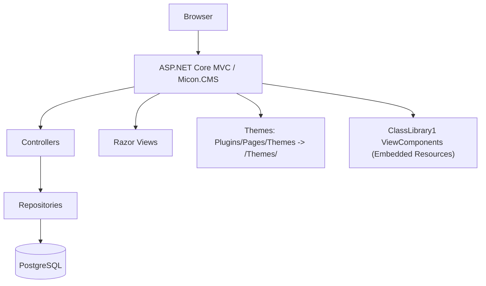
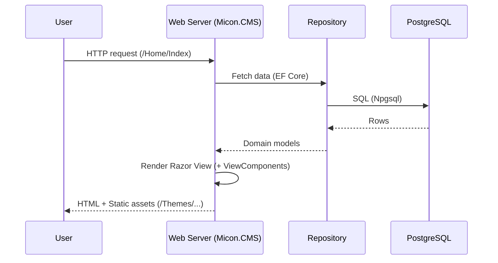

# Micon.CMS

モジュール拡張を前提に設計された、ASP.NET Core（.NET 9）ベースの軽量CMSです。Razorのランタイム再コンパイルやプラグイン/テーマ機構、EF Core（PostgreSQL）を活用して、拡張しやすく運用しやすいWebアプリケーションを目指しています。


> 目的: シンプルなコアに、プラグイン/テーマで機能を追加していける「育てるCMS」。

## 目次
- 概要
- 特徴（What it can do）
- コンポーネント図 / アーキテクチャ
- クイックスタート（OS別）
- 設定と環境変数
- 開発のヒント（拡張方法）
- 既知の注意点
- トラブルシュート
- ライセンス / コントリビュート

## 概要
Micon.CMS は、以下の設計方針で構築されています。
- 拡張容易性: プラグインやテーマで安全に拡張。
- 運用容易性: DBマイグレーション自動適用、Razorランタイム再コンパイル。
- .NET ネイティブ: EF Core、Identity、Razor、Aspire などの標準技術を活用。

想定ユースケース
- プラグイン由来のビュー/コンポーネントでWebページを構成するCMSの基盤。
- テーマ切替や拡張コンポーネントの追加を通じてサイトを段階的に拡張。
- .NET エコシステムを用いた学習/実験・PoC。

## 特徴（What it can do）
- モジュール/プラグイン拡張
  - `Plugins/Pages` 配下のページ/テーマ資産を参照可能。
  - `ClassLibrary1` などのライブラリから、埋め込みリソースとして ViewComponent 等を提供可能。
- テーマ/静的ファイル
  - `Plugins/Pages/Themes` を `/Themes` パスにマウントして配信。
- 認証/認可
  - ASP.NET Core Identity（ユーザー/ロール/トークン）。
- データ永続化
  - EF Core + Npgsql（PostgreSQL）。起動時に `Database.Migrate()` を実行。
- 開発者体験
  - Razor ランタイム再コンパイル、`dotnet watch run` によるホットリロード。
- サービスオーケストレーション
  - .NET Aspire の AppHost/ServiceDefaults を同梱（任意利用）。

## コンポーネント図 / アーキテクチャ


リクエストフロー（概略）


## クイックスタート（OS別）
前提
- .NET SDK 9.0 以上（`dotnet --info`）
- PostgreSQL 14+ 推奨

1) 依存関係の復元とビルド
- Windows (PowerShell): `dotnet restore .; dotnet build Micon.CMS.sln`
- macOS/Linux (bash): `dotnet restore . && dotnet build Micon.CMS.sln`

2) 環境変数の設定（開発）
- Windows: `$env:ASPNETCORE_ENVIRONMENT = "Development"`
- macOS/Linux: `export ASPNETCORE_ENVIRONMENT=Development`

3) 接続文字列の設定（例: ローカルPostgreSQL）
- Windows: `$env:ConnectionStrings__micon-cms-db = "Host=localhost;Port=5432;Database=micon_cms;Username=postgres;Password=postgres;"`
- macOS/Linux: `export ConnectionStrings__micon-cms-db='Host=localhost;Port=5432;Database=micon_cms;Username=postgres;Password=postgres;'`

4) 実行（Debug推奨）
- 共通: `dotnet run --project Micon.CMS`
  - 初回起動時に自動でDBマイグレーションを適用します。

ホットリロード
- 共通: `dotnet watch --project Micon.CMS run`

Aspire AppHost（任意）
- Windows: `dotnet run --project "Micon.CMS.Aspire/Micon.CMS.Aspire.AppHost"`
- macOS/Linux: `dotnet run --project Micon.CMS.Aspire/Micon.CMS.Aspire.AppHost`

## 設定と環境変数
- 環境: `ASPNETCORE_ENVIRONMENT`（Development/Production）
- 接続文字列キー: `micon-cms-db`
  - 環境変数で `ConnectionStrings__micon-cms-db` を設定可能
- `appsettings.json` / `appsettings.Development.json` によるロギング等

## 開発のヒント（拡張方法）
- プラグイン/テーマの追加
  - `Plugins/Pages` 配下に静的資産やRazorページを配置。
  - テーマ資産は `/Themes` として配信されるため、CSS/画像差し替えが容易。
  - プラグインの具体的な作成手順は `docs/plugins.md` を参照。
- ViewComponent をライブラリから提供
```csharp
// ClassLibrary1 側（例）
using Microsoft.AspNetCore.Mvc;
namespace ClassLibrary1.Components.Test;
public class TestViewComponent : ViewComponent
{
    public IViewComponentResult Invoke(string message) => View("Default", message);
}
```
```cshtml
@* Micon.CMS の Razor から *@
@await Component.InvokeAsync("Test", new { message = "Hello from plugin" })
```
- データアクセス
  - EF Core を利用。`dotnet ef migrations add <Name>` → `dotnet ef database update`。
- 認証/認可
  - Identity によりユーザー/ロールベースの制御が可能。

## 既知の注意点（重要）
- Debug 固定のアセンブリ読み込み
  - `Program.cs` で `ClassLibrary1.dll` を `bin/Debug/net9.0` から直接ロードしています。Release 実行時に失敗する可能性があるため、現状は Debug 構成での実行を推奨。
  - Release 対応時は、ビルド構成に依存しないアセンブリ解決（`AppContext.BaseDirectory` 等）への改修を検討してください。

## トラブルシュート
- 接続文字列が解決されない: `ConnectionStrings__micon-cms-db` を確認。
- マイグレーション/EF コマンドが失敗する: `dotnet tool install --global dotnet-ef` を実行し、`--project Micon.CMS` を付与。
- Release でビューやコンポーネントが読み込めない: Debug 固定読み込みが原因か確認。

## ライセンス / コントリビュート
- ライセンス: `LICENSE.txt` を参照。
- Issue/PR 歓迎。規約やOS別コマンドの詳細は `AGENTS.md` にまとめています。
## ER図（データモデル概要）

```mermaid
erDiagram
  TENANT ||--o{ APPLICATION_USER : has
  TENANT ||--o{ APPLICATION_ROLE : has
  TENANT ||--o{ PAGE_TEMPLATE : owns
  TENANT ||--o{ PAGE_CATEGORY : owns
  TENANT ||--o{ PAGE : owns
  TENANT ||--o{ COMPONENT : owns
  TENANT ||--o{ COMPONENT_RELATION : owns
  TENANT ||--o{ PAGE_HISTORY : owns
  TENANT ||--o{ PAGE_TEMPLATE_HISTORY : owns
  TENANT ||--o{ COMPONENT_SETTING : owns

  PAGE_TEMPLATE ||--o{ PAGE_CATEGORY : has
  PAGE_TEMPLATE ||--o{ PAGE : has
  PAGE_TEMPLATE ||--o{ PAGE_TEMPLATE_HISTORY : has
  PAGE_TEMPLATE o|--|| COMPONENT_RELATION : "root relation"

  PAGE ||--o{ PAGE_HISTORY : has
  PAGE ||--o{ COMPONENT_SETTING : config

  COMPONENT ||--o{ COMPONENT_SETTING : config
  COMPONENT ||--o{ COMPONENT_RELATION : as_parent
  COMPONENT ||--o{ COMPONENT_RELATION : as_child

  APPLICATION_USER ||--o{ PAGE_HISTORY : author
  APPLICATION_USER ||--o{ PAGE_TEMPLATE_HISTORY : author

  TENANT {
    GUID Id PK
    string TenantName  "UNIQUE"
    bool IsAdmin
  }
  APPLICATION_USER {
    GUID Id PK
    GUID TenantId FK
    string DisplayName
    datetime Created
    datetime Modified
  }
  APPLICATION_ROLE {
    GUID Id PK
    GUID? TenantId FK
    string Name
  }
  PAGE_TEMPLATE {
    GUID Id PK
    string Name
    GUID? ComponentRelationId FK
  }
  PAGE_CATEGORY {
    GUID Id PK
    string Name
    GUID PageTemplateId FK
  }
  PAGE {
    GUID Id PK
    string Title
    string Description
    GUID PageTemplateId FK
    GUID PageCategoryId FK
    long ViewCount
  }
  PAGE_HISTORY {
    GUID Id PK
    GUID PageId FK
    GUID ApplicationUserId FK
    string Comment
  }
  PAGE_TEMPLATE_HISTORY {
    GUID Id PK
    GUID PageTemplateId FK
    GUID ApplicationUserId FK
    string Comment
  }
  COMPONENT {
    GUID Id PK
    GUID PackageId  "Plugin package GUID"
    string Name     "FQCN of ViewComponent"
  }
  COMPONENT_RELATION {
    GUID Id PK
    GUID? ParentId FK
    GUID ChildId FK
    string SlotName
    int Order
    bool IsPriority
  }
  COMPONENT_SETTING {
    GUID Id PK
    GUID PageId FK
    GUID ComponentId FK
    string Key
    string Value
    string Type
  }
```

- Component はプラグイン ViewComponent の「完全修飾型名（Name）」と「プラグイン識別子（PackageId）」を保持します。
- ComponentRelation は親子関係を表し、子がどの `SlotName` に描画されるかと `Order`（並び順）を管理します。
- PageTemplate は 1 件の ComponentRelation をルートとして採用し、ページ描画のコンポーネントツリーを決定します。
- ComponentSetting はページ単位のキー/値設定を保持し、コンポーネント側の挙動を調整します。

## Plugin の Component 関係と描画の仕組み

- 解決キー
  - `Component.PackageId` → プラグイン DLL に定義された `MiconCmsSettings.PackageId`（`static readonly Guid`）。
  - `Component.Name` → ViewComponent の完全修飾名（例: `ClassLibrary1.Components.C1ViewComponent`）。
- 起動時の読み込み
  - `Program.cs` は `Plugins/**.dll` を再帰的に読み込み、`AddApplicationPart` で MVC に登録、`EmbeddedFileProvider` を追加して埋め込み Razor ビューを解決します。
- ツリーの構築
  - `PageTemplateRepository.GetComponentHierarchy(...)` が DB の `ComponentRelations` を再帰で展開し、`ExternalController` が `PageComponentViewModel` を組み立てます。
- 実描画
  - ランタイムで `AssemblyService.GetType(PackageId, ComponentName)` により型を引き当て、ViewComponent を呼び出します。
  - 親ビューは任意のスロット名で子を描画可能です。

```cshtml
@* 親コンポーネントのビュー（例） *@
@model Micon.CMS.Library.Models.Form.PageComponentViewModel
<div class="content">
  @await Html.LoadChildComponentAsync(Component, "Main")
  @await Html.LoadChildComponentAsync(Component, "Sidebar")
  @await Html.LoadChildComponentAsync(Component, "Footer")
  @* `ComponentRelations.SlotName` と対応 *@
  </div>
```

## Plugin の導入方法（最短ルート）

1) クラスライブラリを作成（.NET 9）
- ViewComponent を実装し、対応する Razor ビューを `EmbeddedResource` として埋め込みます。

```xml
<!-- MyPlugin.csproj 抜粋 -->
<Project Sdk="Microsoft.NET.Sdk">
  <PropertyGroup>
    <TargetFramework>net9.0</TargetFramework>
    <ImplicitUsings>enable</ImplicitUsings>
    <Nullable>enable</Nullable>
  </PropertyGroup>
  <ItemGroup>
    <EmbeddedResource Include="Views\Shared\Components\Hello\Default.cshtml" />
    <Content Include="Views\_ViewImports.cshtml">
      <CopyToPublishDirectory>PreserveNewest</CopyToPublishDirectory>
    </Content>
  </ItemGroup>
</Project>
```

```csharp
// MiconCmsSettings.cs（プラグイン識別子）
public class MiconCmsSettings
{
    public static readonly Guid PackageId = new("aaaaaaaa-bbbb-cccc-dddd-eeeeeeeeeeee");
}

// Components/HelloViewComponent.cs
using Microsoft.AspNetCore.Mvc;
namespace MyPlugin.Components.Hello;
public class HelloViewComponent : ViewComponent
{
    public IViewComponentResult Invoke(string name = "world") => View("Default", name);
}
```

2) DLL を配置
- ビルドした `MyPlugin.dll`（および必要な依存 DLL）を `Micon.CMS/Plugins/` 配下に配置します。
- アプリ起動時に自動検出・登録され、埋め込みビューも解決されます。

3) DB にコンポーネントを登録（最低限）
- `Components` に以下を登録します。
  - `PackageId` = プラグイン側 `MiconCmsSettings.PackageId`
  - `Name` = `MyPlugin.Components.HelloViewComponent`
- ルートとなる `ComponentRelations` を作成し、`PageTemplates.ComponentRelationId` に割り当てます。
- 必要に応じて同一スロットに複数の子を `Order` で並べられます。

4) ページを作成
- `PageCategories` と `Pages` を作り、ページに対する `ComponentSettings`（キー/値）を設定します。

ヒント
- 本リポには動作サンプルとして `Plugins/ClassLibrary1.dll`（PackageId: `fd90ba15-f824-456a-b451-7b0bd102c273`）が含まれています。型名は `ClassLibrary1.Components.C1ViewComponent` / `C2ViewComponent` です。
- 具体的な手順・コツは `docs/plugins.md` も参照してください。
